# 🔍 AI Text Detector

> **Detection을 넘어 Decision으로** — 설명 가능한 장문 AI 탐지 의사결정 보조 시스템

[](https://ai-human-detect.vercel.app)
[](https://youtu.be/4ZUMAO5vzjc)
[](https://python.org)
[](https://fastapi.tiangolo.com)

---

## 🎬 Demo

[](https://youtu.be/4ZUMAO5vzjc)

> 👆 클릭하여 데모 영상 보기

**📊 발표 장표:** [https://ai-human-detect.vercel.app](https://ai-human-detect.vercel.app)

---

## 💡 핵심 아이디어

기존 AI 탐지 모델은 **강건성(Robustness)** 문제가 있습니다:

- 프롬프트가 바뀌면 탐지 성능 급락
- 사람이 AI 초안을 수정하면 탐지 어려움
- 새로운 LLM에 기존 탐지기 무력화

**우리의 해결책:** 강건성을 직접 해결하기보다, **설명 가능성(Explainability)** 을 통해 **신뢰** 문제를 해결합니다.

```
"모델이 왜 이렇게 판단했는지 보여주면, 사용자가 스스로 판단할 수 있다"
```

---

## 🏗️ System Architecture


### 기술적 해결 방향

| Step | 기법      | 해결하는 문제                     |
| ---- | --------- | --------------------------------- |
| 01   | 문단 분할 | 리소스 제약 (~1.2K → 512 tokens) |
| 02   | MIL       | 라벨 제약 (Weak Label Learning)   |
| 03   | LIME      | 설명 가능성 (토큰별 기여도)       |
| 04   | Dashboard | 의사결정 보조 (근거 기반 판단)    |

---

## ✨ 핵심 기능

### 🧠 BERT Deep Learning Engine

| 기능                                       | 설명                                                  |
| ------------------------------------------ | ----------------------------------------------------- |
| **Hierarchical Analysis**            | 문단 단위 분할 → 개별 AI 확률 계산 → 의심 문단 추출 |
| **MIL (Multiple Instance Learning)** | 문서 라벨만으로 문단 단위 학습 가능                   |
| **LIME Explainability**              | 토큰 레벨에서 AI/Human 특성 요인 시각화               |
| **Deletion Test**                    | 핵심 토큰 제거 후 점수 변화로 신뢰도 검증             |

### 📊 Stylistic Fingerprint Engine

| 지표        | 설명                               |
| ----------- | ---------------------------------- |
| 쉼표 밀도   | 100자당 쉼표 사용 빈도 (p < 0.001) |
| 문장 길이   | 중앙값, 표준편차 분포              |
| 어휘 다양성 | TTR, 반복률 측정                   |
| 기능어 밀도 | 조사/어미 사용 패턴                |

---

## 📁 프로젝트 구조

```
AI-Human-Distinction/
├── backend/                 # FastAPI 서버
│   ├── main.py             # API 엔드포인트
│   ├── inference.py        # 추론 서비스
│   ├── lime_analyzer.py    # LIME 설명
│   └── meta_analyzer.py    # 문체 분석
│
├── frontend/               # 웹 대시보드
│   ├── index.html
│   └── js/                 # Chart.js 기반 시각화
│
├── notebooks/              # 분석 노트북
│   ├── colab/             # Colab 전용 (⭐ 추천)
│   └── eda/               # 탐색적 분석
│
├── scripts/                # 실행 스크립트
├── config/                 # 설정 파일
├── data_generation/        # 합성 데이터 생성
└── presentation/           # 발표 자료
```

---

## 📓 Colab Notebooks

Google Colab에서 바로 실행할 수 있는 노트북들:

| 노트북                                    | 설명                | Colab                                                                                                                          |
| ----------------------------------------- | ------------------- | ------------------------------------------------------------------------------------------------------------------------------ |
| `bert_paragraph_classifier_colab.ipynb` | 문단 분류기 학습    | [](notebooks/colab/bert_paragraph_classifier_colab.ipynb) |
| `paragraph_maxpool_colab.ipynb`         | MIL 학습            | [](notebooks/colab/paragraph_maxpool_colab.ipynb)         |
| `explainability_analysis_colab.ipynb`   | LIME/Attention 분석 | [](notebooks/colab/explainability_analysis_colab.ipynb)   |
| `style_trajectory_analysis_colab.ipynb` | 문체 변화 분석      | [](notebooks/colab/style_trajectory_analysis_colab.ipynb) |

---

## 🚀 빠른 시작

### 1. 환경 설정

```bash
git clone https://github.com/YJ99Son/ai-human-detect.git
cd AI-Human-Distinction

python -m venv venv
source venv/bin/activate  # Windows: venv\Scripts\activate
pip install -r backend/requirements.txt
```

### 2. 서버 실행

```bash
# Backend
cd backend && uvicorn main:app --reload --port 8000

# Frontend
cd frontend && python -m http.server 3000
```

→ `http://localhost:3000` 접속

---

## 📡 API 문서

### Endpoints

| Endpoint              | Method | Description           |
| --------------------- | ------ | --------------------- |
| `/analyze`          | POST   | 전체 텍스트 분석      |
| `/checkpoints`      | GET    | 사용 가능한 모델 목록 |
| `/checkpoints/load` | POST   | 특정 체크포인트 로드  |

### Response Example

```json
{
  "prediction": "AI",
  "confidence": 0.87,
  "paragraphs": [
    {"index": 0, "text": "...", "ai_prob": 0.15, "importance": 0.02},
    {"index": 1, "text": "...", "ai_prob": 0.92, "importance": 0.35}
  ],
  "lime_result": {
    "tokens": [
      {"word": "종합적으로", "score": 0.45},
      {"word": "분석하건대", "score": 0.38}
    ]
  },
  "meta_analysis": {
    "features": [{"display_name": "쉼표 밀도", "p_value": 0.003}]
  }
}
```

> 📖 상세 문서: `http://localhost:8000/docs`

---

## 📊 Training Pipeline

```mermaid
flowchart TB
    subgraph Stage1["Stage 1: 문단 분류기"]
        A1[GPT-OSS 합성 데이터<br/>1,140 쌍] --> B1[BERT Encoder]
        B1 --> C1[CrossEntropy Loss]
    end
  
    subgraph Stage2["Stage 2: MIL Fine-tuning"]
        A2[train.csv<br/>97K 문서] --> B2[문단 분할]
        B2 --> C2[BERT<br/>Stage1 가중치]
        C2 --> D2[Max Pooling]
        D2 --> E2[BCE Loss]
    end
  
    Stage1 --> Stage2
  
    style Stage1 fill:#1a1a1a,stroke:#FF6B00
    style Stage2 fill:#1a1a1a,stroke:#FF6B00
```



---

## 📈 Results

### Stage 1: 문단 분류기

| Metric        | Value           |
| ------------- | --------------- |
| Best F1 Score | **0.697** |
| Train Loss    | 0.717           |

### Stage 2: MIL Fine-tuning

| Iteration | Accuracy | F1    | AUC             |
| --------- | -------- | ----- | --------------- |
| 0         | 55.5%    | 0.686 | 0.708           |
| 1         | 81.6%    | 0.843 | **0.987** |

> 📊 자세한 실험 결과는 `notebooks/colab/` 참고

---

## 🔗 Links

- **🚀 Live Demo:** [ai-human-detect.vercel.app](https://ai-human-detect.vercel.app)
- **📺 Demo Video:** [YouTube](https://youtu.be/4ZUMAO5vzjc)
- **📄 Presentation:** [presentation/](presentation/)

---

## 📄 License

MIT License

---
